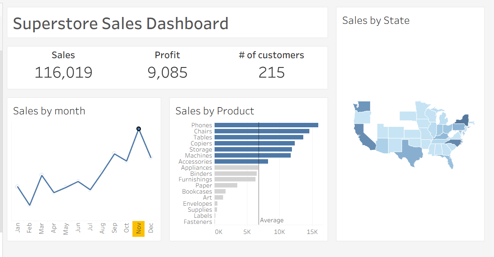

# 🛒 Superstore Sales Dashboard

## 🧾 Overview
An interactive Tableau dashboard built using the Superstore dataset to analyze yearly sales trends, profit performance, and customer behavior across states and product categories.

## 🛠 Tech Stack
- **Tableau** – Dashboard visualization  
- **PostgreSQL** – Data storage  
- **SQL** – Data extraction and analysis  
- **Pandas** – Initial data cleaning

## 🚀 Key Features
- KPIs for Total Sales, Profit, and Distinct Customers  
- Sales Trend Line Chart (Monthly)  
- Top & Bottom Performing Product Categories  
- State-wise Sales Analysis (Choropleth Map)  
- Average vs. Below-Average Product Sales Indicator

## 📊 Insights
- **November** saw the highest sales spike.
- **Phones, Chairs, and Tables** generated the highest revenue.
- **California, New York, and Texas** contributed the most to sales, covering over half of the total customer base.
- **Fasteners, Supplies, and Labels** are the lowest-selling categories.
- **February** was the weakest month in terms of sales.
- **New York** had the highest profit margin.  
- Despite high sales, **Texas showed a negative profit**, while **California** had slightly better profitability.

## 🖼 Screenshots

